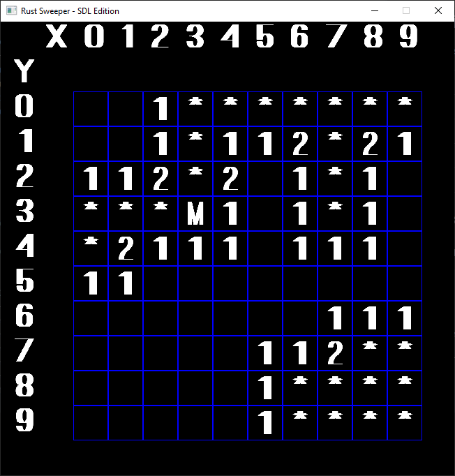

# Rust Sweeper


MineSweeper in Rust for the terminal. This is a learning project for my progress in the Rust language. So it will evolve
over time.

## Commandline Interface

| Parameter | Description                                     |
|:---------:|-------------------------------------------------|
| -s, --sdl | Activate SDL GUI replacing the Console version. |

## User interface

Symbols used in the terminal and graphics:

| Symbol | Description                         |
|:------:|-------------------------------------|
| *      | Unknown                             | 
| _      | Empty                               |
| M      | Mine                                |
| 1-8    | Number of mines in direct vincinity |

### Graphical UI



### Terminal UI

```
Enter x coordinate:
5
Enter y coordinate:
5
Game area:
      0  1  2  3  4  5  6  7  8  9
   +------------------------------
 0 |  *  *  *  *  *  *  *  1  _  _
 1 |  *  *  *  *  *  2  1  1  _  _
 2 |  *  *  *  *  *  2  _  _  1  1
 3 |  *  *  *  *  *  2  _  _  1  *
 4 |  *  *  *  2  1  1  _  _  1  1
 5 |  *  *  1  1  _  _  _  _  _  _
 6 |  *  *  1  _  _  _  _  _  1  1
 7 |  *  *  1  _  _  _  _  _  1  *
 8 |  *  2  1  _  _  _  _  _  1  1
 9 |  *  1  _  _  _  _  _  _  _  _
```

